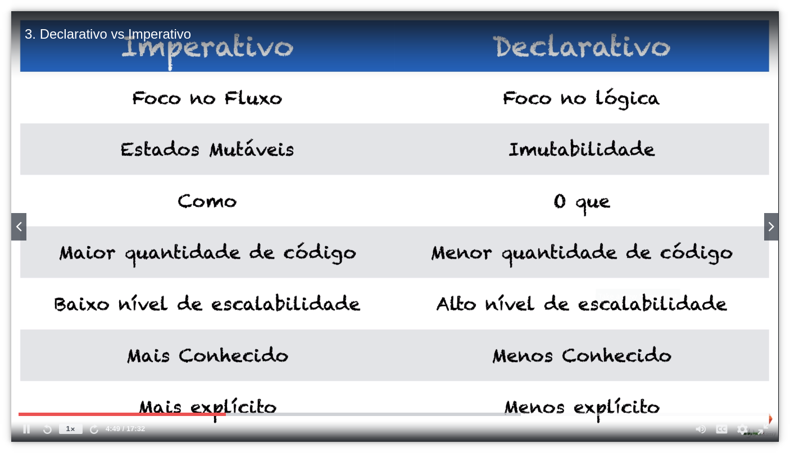
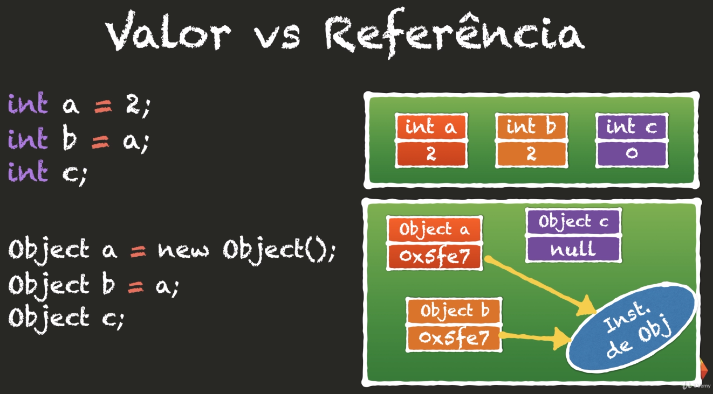

# Curso :: JavaScript Funcional e Reativo - PENSE como um Desenvolvedor JavaScript [2020]

Material do curso "JavaScript Funcional e Reativo - PENSE como um Dev JS [2020]".

# Principais paradigmas de programação

Paradigma é o modelo mental para guiar e dar uma estrutura para transformar um problema do mundo real para um software.

JavaScript é uma linguagem multiparadigma, conseguimos escrever código:
- Procedural
- Orientado a Objeto
- Funcional

## Paradigma e padrões

Padrão Observer: principal padrão de projeto que será trabalhado neste curso. Pode ser usado no mundo funcional, como no mundo OO.

Paradigmas na história
- Funcional: 1957, mas baseou-se no Lambda Cauculus, a base da programação funcional, pelo Alonso Churck.
- Procedural: 1968
- OO: 1980/90

## Paradigma Funcional - Pros e contras

### Pros
O paradigma Funcional consegue lidar melhor com o processamento paralelo, aproveitando assim melhor, os vários núcleos dos processadores.

### Contras
Gera muitas cópias dos dados e estruturas, porque trabalha com dados imutáveis (os novos dados são evoluções dos dados anteriores), consome mais memória.

# Diferenças entre código Declarativo e Imperativo


## Declarativo
Não ensina o "como", ele diz "o que", ou seja, ele diz "o que tem que ser feito" e não "como deve ser feito". Por trabalhar com dados imutáveis, consegue trabalhar melhor com ambiente de múltiplo processamento (múltiplas threads).

## Imperativo
Ensina para o computador o passo-a-passo de "como" deve ser feito uma tarefa.

## Imperativo ou Declarativo?

O seguinte código SQL é imperativo ou declarativo?

```sql
SELECT
    matricula, nome, email, media
FROM
    alunos
WHERE
    media >= 9
```
Trata-se de um **código declarativo**, pois ele diz apenas "o que" deve ser feito. Não estamos a dizer para o banco de dados como é que o sistema deve obter estes dados, por exemplo:
- se deve obter todos os valores de uma vez ou pegar por lotes.
- se vai usar um índice,
- se vai percorrer toda a tabela.
- a ordem em que será feita a busca (crescente ou decrescente).
- se vai fazer em processos paralelos, cada processo com uma quantidade de registos.

Outro exemplo de **código declarativo**: código HTML. Dizemos as divisões que queremos, mas como será feito, será um trabalho do browser, então não sabemos exatamente "como" ele irá fazer.

```html
<div class="featured-content">
    <div class="row">
        <div class="page-title">
            <div class="nomargin shadow">{{ $title }}</div>
        </div>
    </div>
</div>
```
Exemplo de __código imperativo__, onde implementados exatamente como o algoritmo deve fazer em cada passo.

```js
const notas = [8.7, 6.8, 7.7, 9., 5.3, 8.0]

function media(notas) {
    let total = 0
    for (let i = 0; i < notas.length; i++) {
        total += notas[i]
    }

    return total / notas.length
}

const mediaTurma = media(notas)
console.log(`Média é ${mediaTurma}`)
```

Exemplo de __código declarativo__, com o mesmo objetivo do código acima, tendo agora uma implementação mais implícita. Utilizamos a **função redue()** em que realiza uma operaão no array, sem que saibamos o que de fato ela faz por "baixo dos panos".

```js
const notas = [8.7, 6.8, 7.7, 9., 5.3, 8.0]

const somar = (a, b) => a + b
const dividir = (a, b) => a / b

const mediaTurma = dividir(
    notas.reduce(somar),
    notas.length
)
console.log(`Média é ${mediaTurma}`)
```

# Paradigma Funcional

First Class Functions (First Class Citzen - Cidadão de Primeira Classe) -> Funções são valores

**Declaração simples de uma função**

```js
function dobro(x) {
    return x * 2
}

dobro(20)
```

**Declaração simples de uma função**  

Atribuição de uma função anônima a uma variável.

```js
const dobro = function(x) {
    return x * 2
}

dobro(20)
```

Dado este array de alunos e notas, pretende-se gerar uma nova lista dos alunos aprovados (nota >= 7):

```js
const alunos = [
    {nome: 'Ana', nota: 9.5},
    {nome: 'Bia', nota: 7.3},
    {nome: 'Gil', nota: 5.8},
    {nome: 'Leo', nota: 7.6},
    {nome: 'Gui', nota: 9.1},
    {nome: 'Lia', nota: 4.9},
    {nome: 'Rui', nota: 7.0}
]
```
Gerar uma nova lista usando uma **versão procedural** imperativa.

```js
const aprovados = []

for (let i = 0; i < alunos.length; i++) {
    if(alunos[i].nota >= 7) {
        aprovados.push(alunos[i])
    }
}

console.log(aprovados)
```

Gerar uma nova lista usando uma **versão funcional** declarativa.

```js
const estaAprovado = aluno => aluno.nota >= 7 // returns boolean

const aprovados = alunos.filter(estaAprovado) // o filter irá trazer os itens "true"

console.log(aprovados)
```

Higher Order Function (Função de Primeira Ordem)

...

## Valor vs Referência



No exemplo das variáveis primitivas, quando faz **int b = a;** isto é uma **atribuição por valor**, ou seja, é criada uma cópia do valor que estava na variável "a". Isto é comum na programação funcional, pois trabalha com dados imutáveis.

No caso de Objeto, é feita uma **passagem por referência**, então, **Object b** faz referência ao mesmo espaço de memória que o **Object a**.
